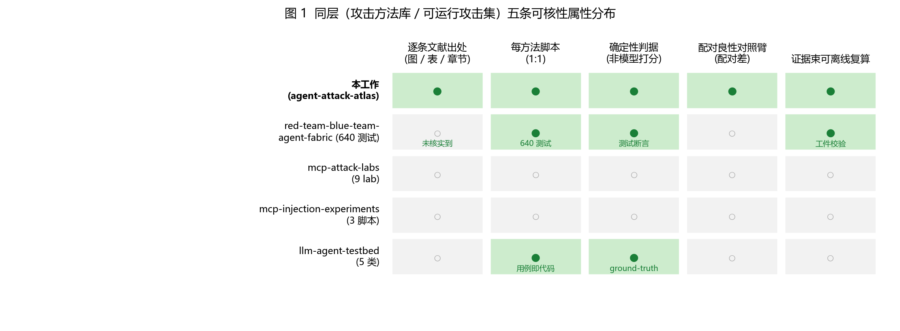
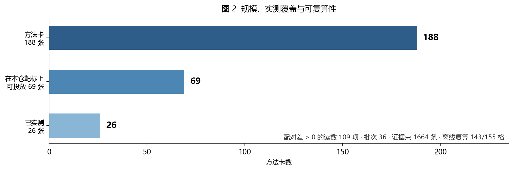

# 相关工作与定位证据

**主张（限定范围）**：在 2026-10-06 执行的检索范围内，未取得同时满足下列四项的公开工作——

> ① 面向**工具调用型智能体**；
> ② **涵盖多种攻击类别**；
> ③ 每一类别**超过十余种**、总方法数丰富的**攻击方法**；
> ④ 每条方法**绑定确定性判据**并配**可执行脚本**，且**随包证据可离线复算**。

本文给出该结论所依据的分层现状、同层对照，以及检索的源、轮次与检索式（§4）。

---

## 1. 必要性：四层的现状与缺口

**表 1　邻近工作的分层现状**

| 层 | 该层提供 | 代表工作（规模为核实值） | 该层缺口 |
|---|---|---|---|
| 综述层 | 分类学与出处梳理 | Kim et al., USENIX Security 2026 SoK（128 篇 / 51 个攻击方法）；Wu et al., ACM CSUR 2026（5 风险域 / 24 类威胁）；Deng et al., ACM CSUR 2025（三层传播范围）；AgentAtlas, arXiv:2605.20530（15 个 agent benchmark 的 0/1/2 覆盖审计） | 无实现、无实测 |
| 环境层 | 场景与任务（靶场） | AgentDojo（36 860 文件，三套件）；ASB, arXiv:2410.02644（10 场景 / 10 agent / 400+ 工具 / 400 任务 / 7 指标）；OpenART（★232，长程任务评估框架） | 攻击为环境组成部分（ASB 攻击实例 ≈16），非可逐条引用的方法资产 |
| 工具层 | 将攻击 / 探针跑起来 | garak（probes 44 模块、detectors 31 模块）；promptfoo（157 插件）；PyRIT（含 converter 的 `.py` 244 个）；DeepTeam（20+ 攻击策略 × 50+ 漏洞类别）；agentic_security；AgentHound（★446，攻击面框架） | 方法单位为探针 / 策略 / 风险类别；判定多为模型打分；单臂报告 |
| 规则层 | 检测与阻断 | Agent-Threat-Rule（22 308 文件、`rules/` 829，Sigma 式检测规则标准）；Janus（★17，工具调用策略执行） | 位于对侧，不提供攻击方法 |

**方法层缺口即本工作的目标**：可引用（出处至图 / 表 / 章节）· 可执行（每条一份定义与一个派生脚本）· 可判定（确定性判据）· 可归因（配对对照效应量）· 可复核（证据束离线重算）。

该缺口同样约束**防御评测**：判定一项防御的拦截幅度，需以"无防御时的逐方法基线"与"同一任务下良性对照的表现"为参照，并可扩展为 `{对抗臂, 良性对照臂} × {防御关, 防御开}` 的 2×2 设计，以分离防御效应与任务固有难度。这构成本工作的直接动因。

---

## 2. 独特性：同层对照

同层（攻击方法库 / 可运行攻击集）可比对象共**四家**（图 1 给出五条可核性属性在五者间的分布）；表 2 末两行补登记后续检出的两家近邻，并给出全部对象的规模与计数单位。

**表 2　同层工作的规模与计数单位**

| 工作 | 规模 | 计数单位 | 类别数 | 出处密度 |
|---|---|---|---|---|
| **本工作** | **188**（各类 **17–29** 种） | 逐条对应一篇公开文献中的一个具体机制 | **8** | 每卡登记出处至图 / 表 / 章节 |
| `msaleme/red-team-blue-team-agent-fabric`（★32） | **640 个唯一测试 ID**（49 个注册模块） | 可执行测试（按安全属性与协议域组织） | 按 MCP · A2A · x402 等协议域 | 未核实到逐条文献出处 |
| `aminrj-labs/mcp-attack-labs`（★21） | 9 | 教学 lab（每 lab：自建脆弱靶标 + 一个攻击 + 对应防御） | 9 | 无逐条出处 |
| `invariantlabs-ai/mcp-injection-experiments`（★206） | 3 | 复现片段（脚本） | — | 无 |
| `pie-script/llm-agent-testbed`（★16） | 5 类 × 1–2 用例 | 结构化用例 | 5 | 无 |
| `Samgar-kz/agentprobe`（★0，PyPI `agentprobe-injection`） | 攻击目录由 **intents × transforms** 组合生成 | 注入意图 × 变换 | 间接注入 | 无逐条文献出处 |
| `sentinelden/agent-injection-bench`（★0，PyPI） | 攻击数据集 + harness + 评分规则（报 compromised% / over-refused%） | 注入用例 | 提示注入 | 无 |

**须同报的两个近似项**（不藏）：

- `msaleme/red-team-blue-team-agent-fabric`（PyPI `agent-security-harness`）：**同层中方法学最成熟者**，须逐项列明。它有 640 个唯一测试 ID（49 个注册模块，`HARNESS_TEST_CATALOG.md` 由脚本在固定提交生成）；输出 **PASS / FAIL / INCONCLUSIVE**，并明文主张"A test that did not reach the target is not a passing security test"；用**五种目标形态哨兵**（端口关闭 / 200 全放行 / 403 全拒绝 / 200 空应答 / 第四种传输形态）扫全套件以证明判定"能错也能对"；另有 52 个失效模式的决策治理语料（`dgb-v1.0.0`）与配套论文（Saleme 2026，目标 arXiv CS.CR）；其 `docs/EVIDENCE-CLASS-TAXONOMY.md` 定义 E1–E5 证据等级与"允许的主张语言"。**与本工作的差异**：它按协议 / 域 / 属性组织测试，不是文献机制级方法集；未核实到逐条文献出处；其评估协议中**未见配对良性对照**（`paired` / `baseline` / `benign` / `judge` / `verdict` 均未出现；README 中的 `paired` 实为 "repaired"、`benign` 为扫描器徽章）；其复算形态是**工件校验**（`verify_veritas.py`）而非判据重放式复算。
- `pie-script/llm-agent-testbed`：判分方式与本工作同向——按已知 ground-truth 秘密判分，而非模型打分（见其 `testbed/attacks.py` 头部说明）。

**同层的进一步差异（不计入本文主张的判定条件，但构成可核性的支撑）**：本工作**逐卡登记公开出处**（至图 / 表 / 章节），并以**配对良性对照臂**给出效应量（`Adv̂`）；这两项在本次检索的同层工作中未见。

---

## 3. 规模、实测覆盖与可复算性

方法层资产为 8 类 188 张方法卡与 188 个派生脚本（1:1）。在本仓库自带靶标（`mcp-local` 与 AgentDojo 三套件）上，可投放 69 张、已实测 26 张；累计 36 个批次、1664 条证据束、**109 项配对差 > 0 的读数**；判据为确定性纯函数，随包证据可离线重算，**155 个格级单元中复现 143 个**（`python tools/rescore.py --all`，无需模型凭据）。

---

## 4. 检索方法与轮次

**4.1 检索源（6 个）**：Crossref · DBLP · arXiv · OpenAIRE · Europe PMC · OpenAlex（经 `tools/bibsearch.py` 统一调用）。每次检索**逐检索式记录各源命中数**，并记录**未答全的源**（超时 / 限流如实入档，与结果一并报告）。

**4.2 文献侧：五轮，共 21 个检索式，取向互不相同**

| 轮 | 取向 | 检索式（逐条列出） | 去重命中 | 源不完整 |
|---|---|---|---|---|
| 1 | 按名称 | `garak LLM vulnerability scanner`；`PyRIT Python Risk Identification Tool generative AI`；`promptfoo LLM red teaming evaluation`；`DeepTeam red teaming framework large language models`；`Agent Security Bench attacks defenses LLM-based agents` | 47 | OpenAIRE |
| 2 | 按能力 | `open source library of prompt injection attacks for LLM agents`；`attack toolkit for tool-calling LLM agents`；`collection of adversarial attacks against LLM agents benchmark`；`agent security evaluation framework paired control arms` | 76 | OpenAIRE |
| 3 | 换措辞（方法库 / 分类学视角） | `attack method taxonomy for agentic AI systems`；`reproducible adversarial prompt library tool-calling agents`；`agent red teaming benchmark open source code` | 37 | 无 |
| 4 | 按**终点资产**（与本工作分类轴对齐） | `memory poisoning attack LLM agent`；`audit log tampering LLM agent`；`tool metadata poisoning MCP server`；`data exfiltration tool calling LLM agent`；`resource exhaustion denial of service LLM agent` | 105 | OpenAIRE |
| 5 | 按**评测方法学** | `paired control evaluation attack success rate LLM agents`；`benchmark attack success rate tool-using LLM agents reproducibility`；`deterministic judge evaluation adversarial LLM agent`；`evidence bundle reproducible evaluation LLM security` | 45 | DBLP · OpenAIRE |

合计去重命中 310 条。Crossref 每式返回上限 40 条，故命中数不等于相关条数；文献源命中的与目标直接相关者主要是**有论文的工作**（如 ASB），工具类工作几乎不在文献源中出现。

**4.3 仓库侧：16 个检索取向 + 逐仓库直读**

第一组（按星，10 个取向）见下表；第二组按"**定位措辞 + 更新时间**"补检 6 个取向（`attack library LLM agents` · `attack suite agent security` · `adversarial attack collection LLM` · `attack catalog prompt injection` · `agent attack methods` · `llm attack toolkit benchmark`），命中的多为 ★0–3 的小项目，其中 `sentinelden/agent-injection-bench` 与 `Samgar-kz/agentprobe` 已登入表 2。此外补跑：**GitHub topics 长尾 5 个**（`prompt-injection` · `llm-security` · `adversarial-attacks` · `agentic-security` · `ai-security-tool`）· **PyPI 全量包名索引扫描**（908 422 个包名，按 "agent/LLM 相关 且 攻击相关" 双条件收紧后 58 个候选）· Gitee 检索（返回空）· HuggingFace（经外部检索间接覆盖，**本机直连超时**）。

| 取向 | 结果总数 | 代表性命中 |
|---|---|---|
| `agent security attack` | 967 | `gadievron/raptor`（★3876）· `capitalone/VulnHunter`（★1082）· `ethz-spylab/agentdojo`（★899） |
| `mcp attack poisoning` | 74 | `adithyan-ak/AgentHound`（★446）· `Agent-Threat-Rule/agent-threat-rules`（★409） |
| `prompt injection tool-calling agent` | 72 | `StackOneHQ/defender`（★126）· `pie-script/llm-agent-testbed`（★16） |
| `topic:agent-security` | 1786 | `NVIDIA/SkillSpector`（★19745）· `Tencent/AI-Infra-Guard`（★6799）· `msoedov/agentic_security`（★2019） |
| `awesome agent security` | 151 | `scadastrangelove/awesome-ai-security-tools`（★1596） |
| `agent red team benchmark` | 54 | `Yeti-791/Awesome-Offensive-AI-Agentic-Landscape`（★344）· `msaleme/red-team-blue-team-agent-fabric`（★32） |
| `topic:mcp-security` | 519 | `nolabs-ai/nono`（★4410）· `stacklok/toolhive`（★2259） |
| `topic:llm-security agent attack` | 224 | `adithyan-ak/AgentHound`（★446）· `getagentseal/agentseal`（★377） |
| `agent attack method library` | **2** | 无相关命中（该取向在本轮未取得同类工作） |
| `tool poisoning benchmark` | 18 | `AI45Lab/OpenART`（★232）· `zhiqiangwang4/MCPTox-Benchmark`（★13） |

对入选仓库**逐一读取 README、文件树（含目录级计数）与关键源文件**，核对规模、组织方式与判定方式，不依据项目自述作结论。此外，为避免漏掉"藏在其他仓库子目录中的方法集"，另以**代码级检索**（第 17 组，8 个取向）复核，见 §4.6。

**4.4 一个必须报告的方法学观察**：同层中最接近的工作（`red-team-blue-team-agent-fabric`）**只在取向扩展到 10 个、且使用 `agent red team benchmark` 这一措辞时才出现**。这说明检索取向的多样性直接决定结论强度；本文因此把轮次与检索式逐条列出，供复核与后续补充。

**4.5 两类来源为何必须并用**：文献源对软件工件覆盖极差（Crossref 结果多为无关论文、DBLP 命中为 0），工具与方法库类工作只能由仓库侧登记。

**4.6 代码级检索（第 17 组，已认证，8 个取向）**

前 16 个取向检索仓库元数据与文件路径；本组检索**代码与文档正文**（GitHub code search，认证调用），逐条原始响应按检索式归档留存，可供复核。命中总数与代表性命中如下。

| 检索式 | 命中 | 代表性命中 |
|---|---|---|
| `"attack method library"` | 6 | 全部命中为同一项目（`Tencent/AI-Infra-Guard`）的 prompt-eval 文档，及其副本仓库 |
| `"method cards" attack agent` | 128 | `carbonphysicsai/Carbon`（攻击知识模块与测试 agent 计划） |
| `"attack catalog" LLM` | 936 | `icdev-ai/icdev`（`args/llm_red_team_catalog.yaml`、`tools/security/llm_red_team.py`） |
| `"paired control arm"` | 95 | `AgentEvalHQ/AgentEval`（`docs/findings/RUN_PROTOCOL.md` 等；用于**评测方法学**，非攻击测量） |
| `"benign control arm" injection` | 26 | `provael/provael` · `QuantaMinds/QuantaMind` · `sattyamjjain/agent-airlock` |
| `"attack methods" "tool-calling"` | 255 | `LLMSecurity/awesome-agent-skills-security`（清单）· `Tencent/AI-Infra-Guard` |
| `"indirect prompt injection" "ground truth" dataset` | 3 224 | `Abraheem13/iobnt-agentjack`（`src/agentjack/data/registry.py`）· `ydyjya/Awesome-LLM-Safety`（清单） |
| `"literature" "attack methods" agent benchmark` | 4 536 | 以清单与文献综述类仓库为主 |

命中仓库经逐一核实（元数据 + 文件树）后，**与本工作定位最近者**是 `provael/provael`（★7，Apache-2.0，1 066 文件）：VLA 机器人策略域的红队工具，其 ASR 定义为**越出策略良性安全包络的比例**，配 matched benign false-positive control 与 **95% Wilson 区间**，并设有一页"哪些已发表数字可与自身同栏比较"的标准（`docs/standards/published-asr-baselines.md`，结论是多数数字"不属于同一栏"：对方量任务成功率下降，它量包络越界）。该工作不在工具调用型智能体域，故不入表 2；列出它是为标明**"良性对照臂 + 区间"这一做法在另一域已有实现**，因而配对对照本身不构成本工作的差异项（§5.11）。

**4.7 日期**：检索执行于 2026-10-06（含代码级检索）；星数与仓库结构为该日读数。

---

## 5. 局限

1. **检索不完整**。Crossref 单次返回上限 40 条；OpenAIRE 在第 1、2、4、5 轮部分失败，DBLP 在第 5 轮部分失败。故本文所有"未取得"仅指**本次检索范围内**未取得，不构成"不存在"的断言。
2. **取向多样性仍是上限**。第 3–5 轮为新增轮次；最接近的同层工作由第 10 个仓库取向才检出（§4.4）。后续仍可能存在未被这 10 个取向覆盖的项目。
3. **文献源不覆盖软件工件**。工具类工作在文献源中命中率极低，这类工作仅由 GitHub 与官方源登记；两类来源不可互替。
4. **计数单位不可比**。188（文献机制）、640（可执行测试）、20+（攻击策略，另需乘 50+ 漏洞类别）、≈66（探针类）、157（风险类别插件）、≈16（benchmark 攻击实例）为不同单位，**不得跨单位比较大小**。
5. **部分数字为自述或估算**。DeepTeam 的"50+ / 20+"取自其 README；garak 探针类数由 6 个模块抽样外推，非官方计数，正式引用前应以 `garak --list_probes` 实跑替换；PyRIT 与 promptfoo 的计数以文件路径 / 插件页为代理。
6. **否定性结论的边界**。关于"未见配对对照""未见逐条出处"的判断，仅基于公开文档与仓库目录结构（对 `red-team-blue-team-agent-fabric` 的判断基于其 `EVALUATION_PROTOCOL.md`；对 `agentprobe` / `agent-injection-bench` 的判断基于其 README、文件树与 `registry.py` / `oracle.py` 源码），未逐文件审计全部实现代码；代码级检索的否定性判断亦限于 §4.6 所列 8 个检索式的覆盖范围。
7. **快照性**。星数、推送日期与仓库结构为 2026-10-06 读数，上游会变化。
8. **本工作自身的边界**。188 张卡中可投放 69、已实测 26；跨批次比较要求靶标构建指纹一致，跨靶标不合并；靶标独立来源为两个；判据效度（对上游断言的精确率 / 召回率）尚未执行；T05 的 `selection_channel` 未入证据束，8 个格不在离线复算覆盖内。
9. **覆盖与前缺口**：① 代码级检索（GitHub code search，认证后）已于同一日期执行 8 个取向，结果见 §4.6；其范围限于 GitHub 已索引的**公开仓库默认分支**，且结果按相关度截断，故仍不能排除这 8 个取向未覆盖到的实现；② HuggingFace 本机不可直连，其数据集/Space 仅经外部检索确认存在，规模与内容未核。
10. **比较维度单一**。本表按"可核性属性"评价，未评估工程成熟度、社区规模与维护活跃度等非目标维度。
11. **同层方法学近邻存在于另一域**。代码级检索在 VLA 机器人策略域检出 `provael/provael`，其 ASR 已配良性对照地板与 95% Wilson 区间，并单列跨来源可比性标准（§4.6）。因此**配对对照本身不是本工作的差异项**：本工作的差异是"工具调用型智能体域 + 逐条文献出处 + 逐卡确定性判据 + 随包证据离线复算"的合取。
